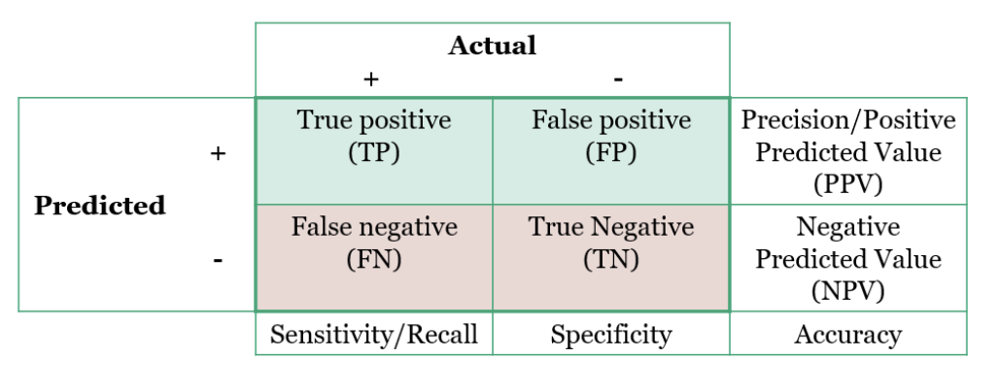

```{r setup, include=FALSE}
knitr::opts_chunk$set(
    echo = TRUE,
    message = FALSE,
    warning = FALSE)
```


# CHURN MODELING USING MACHINE LEARNING

Considerations:
- The case study attempts to tackle a __classification__ problem:
- It uses `tidymodels` (and `parsnip` in particular) to create & execute a tidy modelling workflow.
- Goal: demonstrate the easiness to fit a simple logistic regression in R's `glm` and quickly switch to a __cross-validated random forest__ using the `ranger` engine by changing a few lines of code.
- Data exploration & wrangling are kept to a minimum (tough they are paramount steps, in this case study, the modeling workflow is the main focus).

# WORKFLOW

The main steps in my workflow:
1. Start with raw data in CSV format
2. Use `skimr` to quickly understand the features
3. Use `rsample` to split into training/ test sets
4. Use `recipes` to create data preprocessing pipelines
5. Use `parsnip`, `rsample` and `yardstick` to build models & assess ML performance


# 1.0. Setup libraries & load dataset

## Packages

Mainly using several libraries within `tidymodels` package: 
- `parsnip`: ML API in R, similar to scikit learn in Python,
- `rsample`: 10-fold cross-validation,
- `recipes`: data preprocessing,
- `yardstick`: model scoring & metrics

```{r}
library(tidyverse)  # loads `dplyr`, `ggplot2`, `purrr`, ...
library(tidymodels) # loads `parsnip`, `rsample`, `recipes`, `yardstick`
library(skimr)      # quickly get a sense of the data
library(knitr)      # pretty html tables
library(ranger)     # random forest library (used for churn modeling)
library(ggrepel)    # add labels in ggplot2
```

## Dataset
Source: Telco Customer Churn from IBM Watson Analytics
Data structure: 7,043 rows (each representing a customer), 21 columns, prospective predictions to forecaset customer behaviour and help developed focused customer retention programmes.

__Churn__ is the __dependent variable__; it shows customers who left within the last month.
The dataset comprises also details on the __services__ each customer signed up for, along with __account__ and __demographics__ information


```{r}
path <- "data/WA_Fn-UseC_-Telco-Customer-Churn.csv"
telco <- read_csv(path)

telco %>% head()
```

# 2.0. Skim the data

Get a sense of the data using `skim()` from `skimr` package.

Data considerations:
- __customerID__ is a unique identifier and has no descriptive or predictive power. Actions: remove from list of predictors
- Very small number of missing value in __TotalCharges__ variable (11 obs). Action: remove these observations

```{r}
telco %>% skim()
```

```{r}
telco <- telco %>%
    select(-customerID) %>%
    drop_na()
```


# 3.0. Tidymodels Workflow - Generalized Linear Model (Baseline)

I start by fitting & evaluating a simple regression model in order to illustrate the basic steps in the `tidymodels` framework.

## 3.1. Train/ test split
`rsample` provides a streamlined way to create a randomised training & test split of the original data
I split a train set & test set with a proportion 80%-20% of the original data, and assign each as `train_tbl` and `test_tbl` respectively. 

```{r}
set.seed(seed = 1972)

# split original data into train set (80%) and test set (20%)
train_test_split <-
    rsample::initial_split(
        data = telco,
        prop = 0.80
    )

train_test_split

# save each split into train and set tibbles
train_tbl <- train_test_split %>% training()
test_tbl  <- train_test_split %>% testing()
```

## 3.2. Data preparation with recipes

`recipes` uses a __cooking metaphor__ to handle all the data preprocessing (i.e. missing imputation, removing predictors, centric, scaling, one-hot-encoding,...)

Steps:
- 1) First, create the recipe where I define the transformations to apply to the data. My main transformation is switching character variables into factors
- Then, I prepare the recipe by mixing the ingredients with the `prep()` function.

```{r}
recipe_simple <- function(dataset) {
    recipe(Churn ~ ., data = dataset) %>%
        step_string2factor(all_nominal(), -all_outcomes()) %>%
        prep(data = dataset)
}
```

- 3) In order to avoid __Data Leakage__ (transferring information from the train set to the test set), data should be prepped using train_tbl only

```{r}
recipe_prepped <-  reciple_simple(dataset = train_tbl)
```

- 4) Finally, continuing with the cooking metaphor, I bake the recipe to apply all preprocessing to the data sets
```{r}
train_baked <- bake(recipe_prepped, new_data = train_tbl)
test_baked  <- bake(recipe_prepped, new_data = test_tbl)
```


## 3.3. Machine Learning & Performance

__Fit the Model__
`parsnip` is part of `tidymodels` suite. It offers a unified API that allows access to several ML packages without the need to learn the syntax of each individual one.

In 3 steps you can:
1) Set the type of model to fit (i.e. a logistic regression) and its mode (i.e. classification)
2) Choose the computation engine to use (i.e. `glm`). (For logistic regression, `glm`, `glmnet`, `stan`, `spark`, `keras`)
3) spell out the exact model specification to fit (i.e. use all variables) and what data to use (i.e. the baked train set)

```{r}
logistic_glm <- logistic_reg(mode = "classification") %>%
    set_engine("glm") %>%
    fit(Churn ~ ., data = train_baked)
```


*Assess Performance*

First, I compare the model's predictions against the actual outcomes

```{r}
predictions_glm <- logistic_glm %>%
    predict(new_data = test_baked) %>%
    bind_cols(test_baked %>% select(Churn))

predictions_glm %>% head()
```

I will base my classification model's performance upon 4 metrics: __accuracy__, __precision__, __recall__ & __F1 score__.
These can be derived from the __Confusion Matrix__, used to describe the model performance on a set of test data for which the true values are known.

The Confusion Matrix shows:
- __True Positives (Tp)__: model correctly predicts true cases
- __False Positives (Fp)__: model fails to predict true negative cases
- __False Negatives (Fn)__: model fails to predict true positive cases
- __True Negatives (Tn)__: model correctly predicts negative cases

Then allows to calculate the desired metrics:
- __Precision__ (or PPV -Positive Predicted Value-): Tp/(Tp+Fp)
- __Recall__ (or Sensitivity): Tp/(Tp+Fn)
- __Negative Predicted Value (NPV)__: Tn/(Tn+Fn)
- __Specificity__: Tn/(Tn+Fp)
- __Accuracy__: (Tp+Tn)/(Tp+Tn+Fp+Fn)
- __F1 Score__: harmonic average of Precision and Recall. Best value = 1 (perfect)



```{r}
# Confusion table
table <- predictions_glm %>%
    conf_mat(Churn, .pred_class) %>% #conf_mat from `yardstick` package
    pluck(1) %>%
    as_tibble() 

# Plot Confusion Matrix
plotTable <- table %>%
    mutate(goodbad= ifelse(table$Prediction == table$Truth, "good", "bad")) %>%
    group_by(Truth) %>%
    mutate(prop = n/sum(n)) %>%
    
    ggplot(mapping = aes(x = Truth, y = Prediction, fill = goodbad,  alpha = prop)) +
    geom_tile(show.legend = TRUE) + 
    geom_text(aes(label = n), vjust = .5, fontface = "bold", alpha = 1, size = 8) +
    scale_fill_manual(values = c(good = "green", bad = "red")) +
    theme_bw() +
    ggtitle("Confusion Matrix")

plotTable
```
Remarks on metrics:
- __Accuracy__ is not a very realiable metric, as will provide misleading results in case of inbalanced data. In our case, accuracy reaches 80% with only very basic data manipulation
- __Precision__ shows how sensitive the model is to False Positives
- __Recall__ shows how sensitive the model is to False Negatives


```{r}
predictions_glm %>%
    metrics(Churn, .pred_class) %>%
    add_row(precision(predictions_glm, Churn, .pred_class)) %>%
    add_row(recall(predictions_glm, Churn, .pred_class)) %>%
    add_row(f_meas(predictions_glm, Churn, .pred_class)) %>%
    select(-.estimator)
```

# 4.0. Random Forest - ML modeling and Cross Validation

Use the `tidymodels` modeling framework to fit a __Random Forest__ with the `ranger` engine


## 4.1. 10-fold Cross Validation
I use a 10 fold cross validation to further refine the model's predicitive power, using `vfold_cv` from `rsample`, which splits again the initial training dataset

```{r}
cross_val_tbl <- vfold_cv(train_tbl, v = 10)

# verifies that 563 observations have been retained at each round, and used to validate the model
cross_val_tbl %>% pluck("splits",1)
```

## 4.2. Machine Learning

### Random Forest

Switching to another model requires only to:
- change the type of model to `random_forest`, 
- add its hyperparameters, and
- change the set_engine argument to ranger.

I bundle all steps into a function that estimates the model across all folds, runs predictions and returns a tibble with all results.
Prior to recipe prepping, I add an extra step to map the cross-validation splits to the `analysis()` and `assessment()` functions.

```{r}
rf_fun <- function(split, id, try, tree) {
    
    analysis_set     <- split %>% analysis()
    analysis_prepped <- analysis_set %>% recipe_simple ()
    analysis_baked   <- analysis_prepped %>% bake(new_data = analysis_set)
    
    model_rf <-
        rand_forest(
            mode = "classification",
            mtry = try,
            trees = tree
        ) %>%
        set_engine("ranger",
                   importance = "impurity") %>%
        fit(Churn ~., data = analysis_baked)
    
    assessment_set     <- split %>% assessment()
    assessment_prepped <- assessment_set %>% reciple_simple()
    assessment_baked   <- assessment_prepped %>% bake(new_data = assessment_set)
    
    tibble(
        "id"         = id,
        "truth"      = assessment_baked$Churn,
        "prediction" = model_rf %>%
            predict(new_data = assessment_baked) %>%
            unlist()
    )
}
```


### Modeling with purrr

I iteratively apply the random forest modeling function, `rf_fun()`, to each of the 10 cross validation folds using `purrr`

```{r}
pred_rf <- map2_df(
    .x = cross_val_tbl$splits,
    .y = cross_val_tbl$id,
    ~ rf_fun(split = .x, id = .y, try = 3, tree = 200)
)

head(pred_rf)
```


